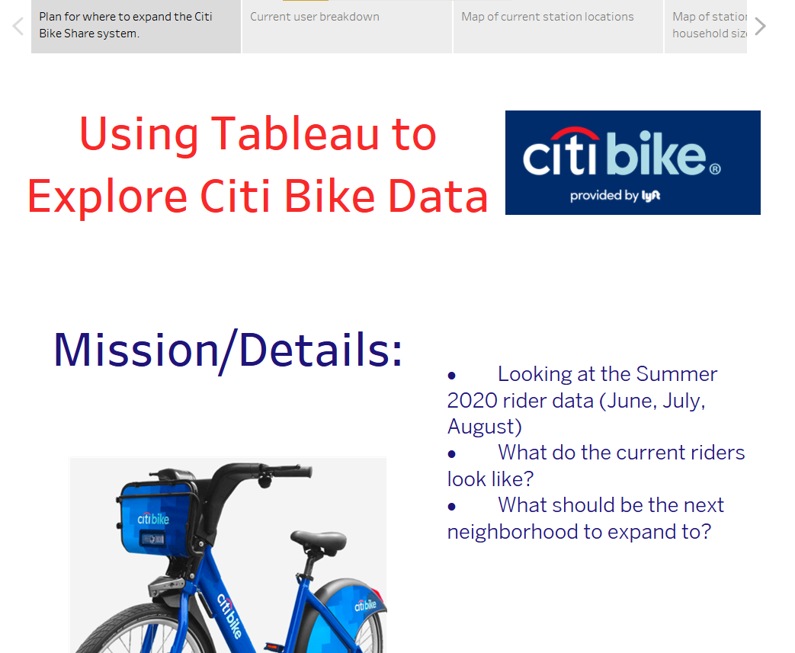
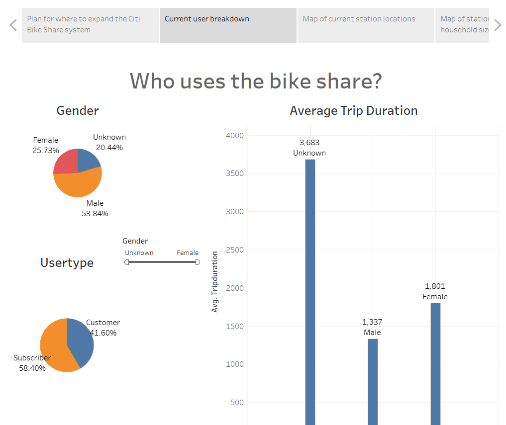
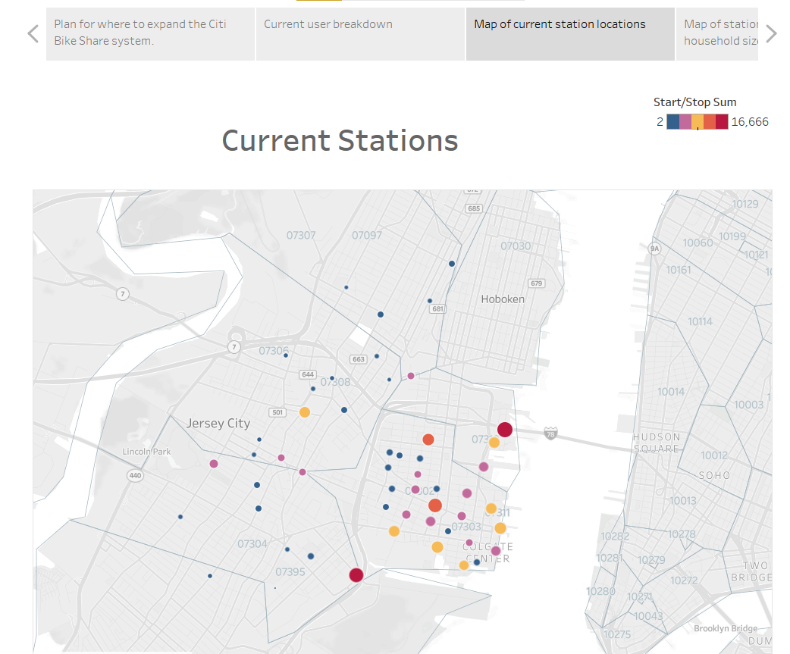
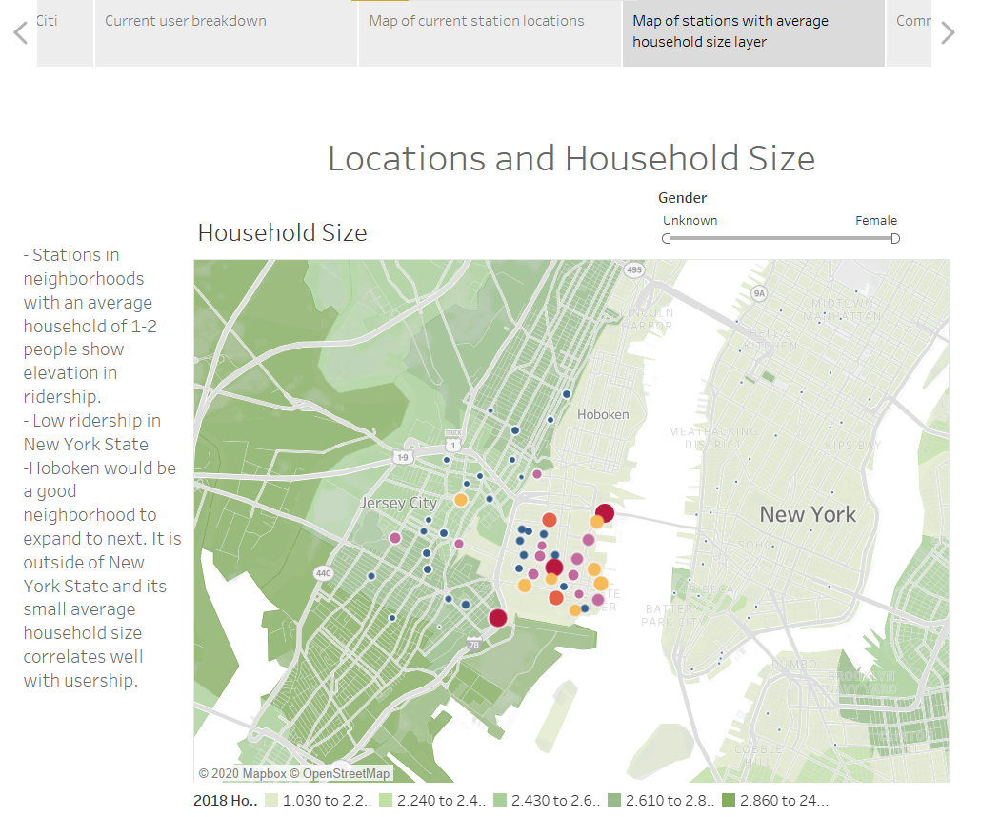
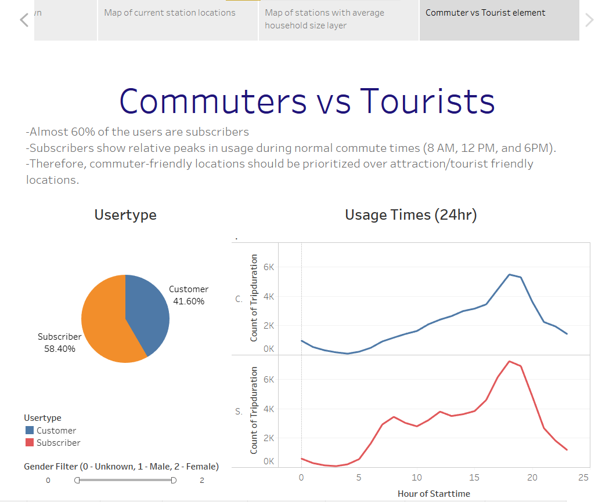

# Citi-Bike-Analysis

### The Tableau Public link to this analysis is here: 
https://public.tableau.com/profile/jason.cristini#!/vizhome/CitiBikeNewStationPlan/CitiBikeNewStationPlan

For this analysis, I took the role of the analyst who will use a Tableau story to assist the city officials in their determination of where the next phase of the bike share system will spread to. They are looking for tangible insights into what neighborhood and/or what metrics they should be looking for to help them make their decisions. In order to answer these questions, I went to the Citi Bike data website at https://www.citibikenyc.com/system-data and pulled 3 csv files. The 3 files were of all the user trips in the months of June, July, and August of 2020. I chose the 3 summer months, since I assumed that is when the ridership was the greatest. 

The first dashboard I created illustrated to the city officials who were the current users of the system. It gave the officials the gender breakdowns, the type of users (customers vs subscribers) percentages, as well as the average trip duration by gender. These visualizations could also be filtered by gender and usertype so the officials would be able to answer questions relating to trip duration by usertype, usertype by gender, etc.

The next dashboard I created was a map of the current stations. The radius and color of the markers was responsive to the usage for the station. The usage included both bike pick ups and bike drop offs. I also added zip codes onto the map for reference. When the users roll over the points, I also included pop ups for the station names and the number of pick ups and drop offs over the time period.

Now I dug into my recommendations. My next dashboard related the current stations and usage to household size. As you can see, stations located in neighborhoods where the average household size was 1 or 2 occupants were used more often, therefore Hoboken should have a good arguement to be considered a good location for new stations, since its household size is similar. Although New York has small households, its stations are barely used which again adds to Hoboken, New Jersey's claim to more stations. I added 2 more details for the officials. The first is they can filter on gender. The second is the pop ups again have the stations name and usage number listed, but also the percent of total uses for each location. 

Lastly, I looked at the data from the lens of commuters/residents vs tourists/non-residents. I know the location of a station could be contested based on if it would be close to an attraction (for the tourist) or close to work/housing (for the commuter). Therefore, I created a dashboard to compare and contrast who would be using the station the most as well as when they are. From the pie graph, it is shown that commuters make up a higher percentage of rides. Also, line graph shows relative increases in riderships at usual commute times (8 am, 12 pm, and 6 pm). Therefore my recommendation would be to place the locations in work and home heavy locations vs tourist attraction locations. 

